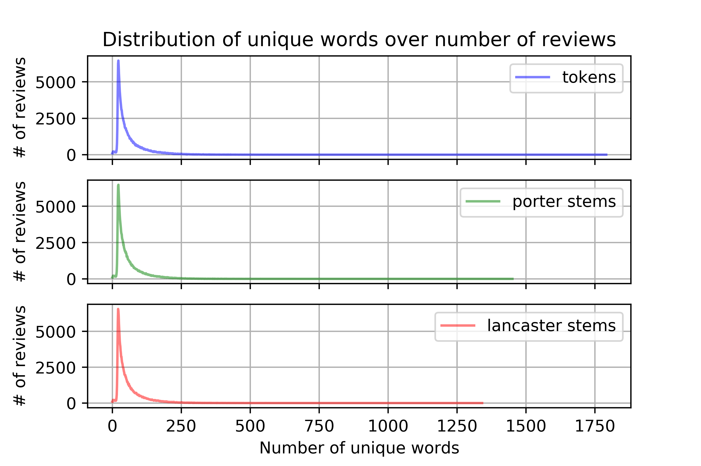

# Tokenizer and Stemmer

## Run

```shell
python tokenizerandstemmer.py 
```

## Arguments

| Argument        | Type   | Description                                                  | Default                               |
| --------------- | ------ | ------------------------------------------------------------ | ------------------------------------- |
| --jsonfile      | string | Location of json file to load as data.                       | ../../../DataSet/CellPhoneReview.json |
| --columnname    | string | Name of column to tokenize and stem in data.                 | reviewText                            |
| --lazyload      | bool   | Set to true to load data from file instead of generating from NLTK. Default is False. | False                                 |
| --tokenfile     | string | Location of the token file for lazy loading. Set empty to not generate. | data/tokens.data                      |
| --porterfile    | string | Locationof the porter file for lazy loading. Set empty to not generate. | data/porter.data                      |
| --lancasterfile | string | Location of the lancaster file for lazy loading. Set empty to not generate. | data/lancaster.data                   |

## Example Output

 
